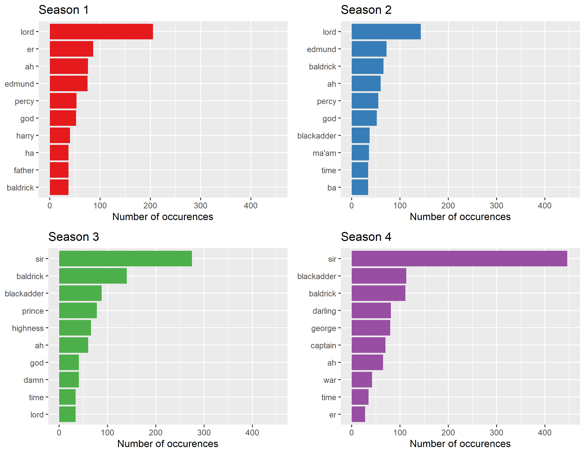

<!-- README.md is generated from README.Rmd. Please edit that file -->

# Simple Text Analyis of The Black Adder

This repository is the companion example of the presentation [Caring
about Code](https://github.com/ALanguillaume/CaringAboutCode). It is
meant to showcase R coding best practices and teach students how to set
up a modular workflow.

## The Cunning Result:

